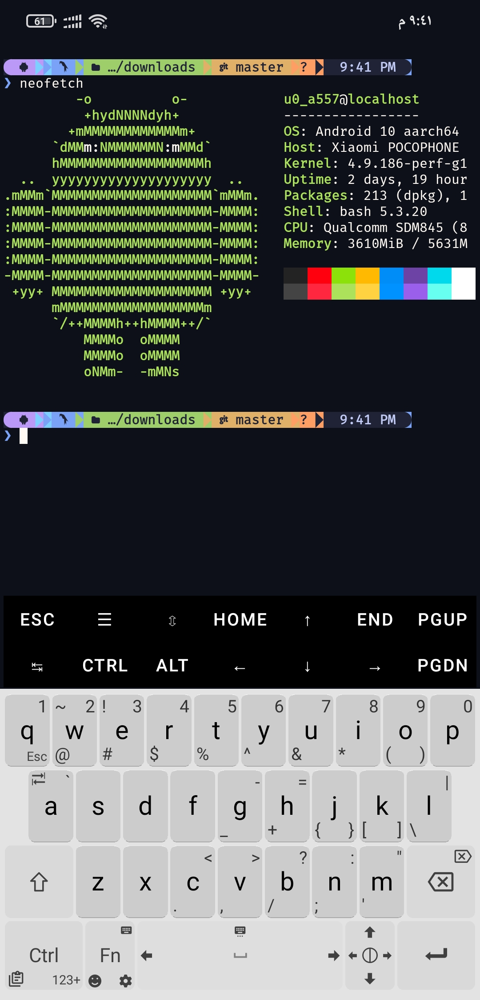
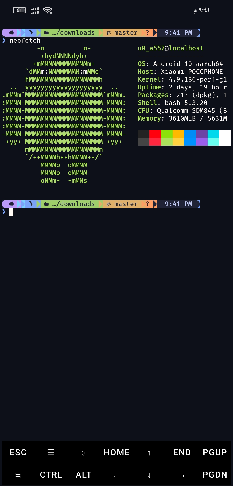
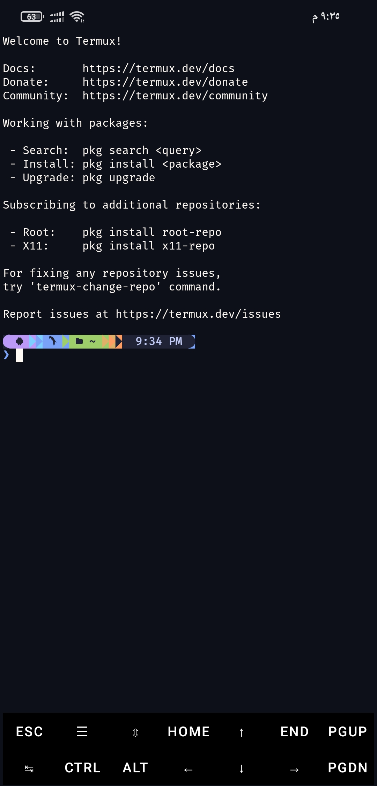
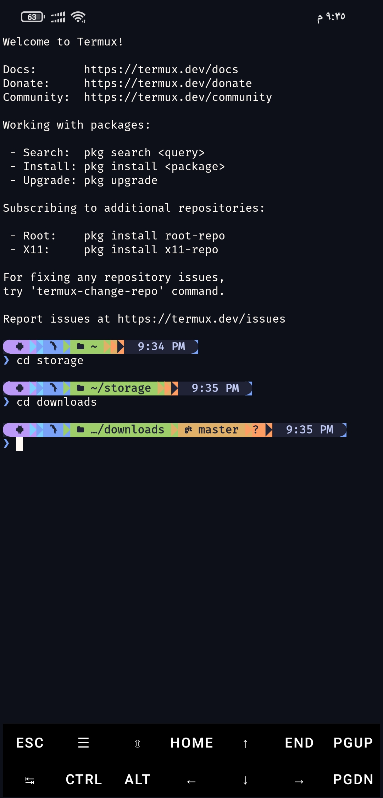

# 🎨 fuor-termux-them

<div align="center">


**A beautiful Powerline-style Starship prompt theme for Termux, with harmonious colors inspired by Tokyo Night.**

</div>

---

## 📸 Screenshots

### Main View


### More Views

| View 1 | View 2 |
|---|---|
|  |  |

### View 3


---

## ✨ Features

- 🌈 **Tokyo Night Color Palette** — Harmonious purple, blue, cyan, green, and orange.
- ⚡ **Powerline-Style Segments** — Seamless arrow transitions between segments.
- 🤖 **OS Detection** — Displays the Android logo automatically.
- 👤 **User & Host** — Always visible, styled clearly.
- 📁 **Smart Directory Display** — Truncated to 3 levels with ellipsis.
- 🌿 **Git Integration** — Shows branch name and status (ahead, behind, dirty).
- ⏰ **Time Display** — 12-hour format on the right.
- 💻 **Language Detection** — Automatically detects and displays icons for **16 languages**:
  Rust, Node.js, Go, Python, C, C++, Java, PHP, Ruby, Swift, Kotlin, Lua, Perl, Haskell, Elixir.
- ☁️ **Cloud & DevOps** — Detects Docker, Kubernetes, AWS, GCloud, Terraform.

---

## 🎨 Color Palette

| Segment | Color | Hex |
|---|---|---|
| OS | Purple | `#bb9af7` |
| User | Cyan | `#7dcfff` |
| Host | Blue | `#7aa2f7` |
| Directory | Green | `#9ece6a` |
| Git Branch | Yellow | `#e0af68` |
| Git Status | Orange | `#ff9e64` |
| Time | Light | `#c0caf5` |
| Error | Red | `#f7768e` |

---

## 📦 Requirements

- [Termux](https://github.com/termux/termux-app) — latest version from [F-Droid](https://f-droid.org/)
- [Starship](https://starship.rs/) — install with `pkg install starship`
- A **Nerd Font** installed in Termux (recommended: JetBrains Mono, Fira Code, Hack)
- `curl` or `wget`

---

## 🚀 Installation

### Method 1: One-liner

```bash
curl -fsSL https://raw.githubusercontent.com/izzotv/fuor-termux-theme/main/install.sh | bash
